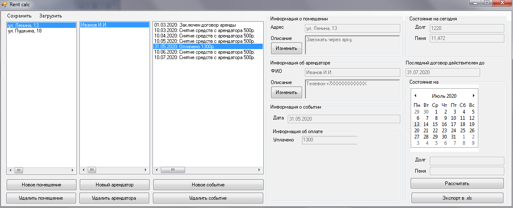
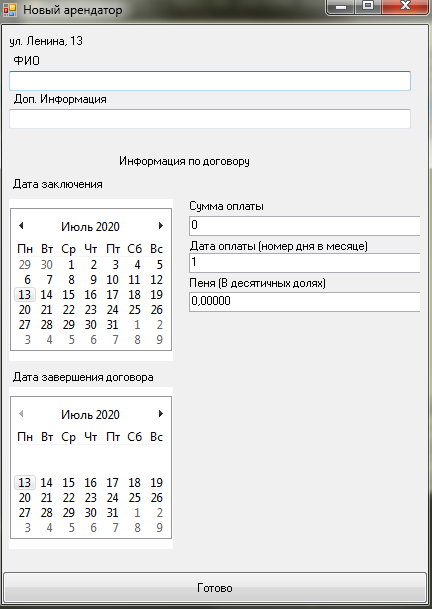
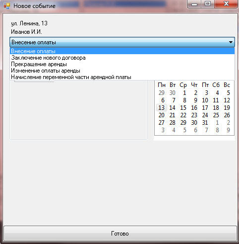
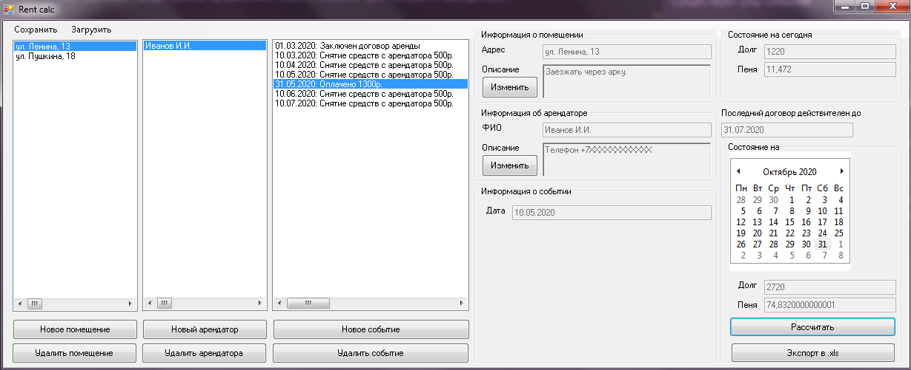

# Rent calc
Простая система учета арендаторов.

## Установка

Для работы требуетсся .net Framework.
1. Скачать нужную версию из релизов и распаковать ее.
2. Запустить.

## Использование

Добавление нового помещения/арендатора/события происходит при помощи кнопки "Новое ...".
Добавление нового арендатора происходит к текущему выбранному помещению, 
а события к текущему выбранному арендатору.

Для выбора помещения/арендатора/события требуется кликнуть левой кнопкой по нему в списке, 
выбранный объект будет выделен цветом.

На картинке представлено добавление нового арендатора в текущее выбранное помещение.
Как можно видеть, кроме данных об арендаторе, требуется сразу заполнить информацию о заключенном
договоре(дата начала, окончание, сумма в месяц, дата ежемесечной оплаты, пеня за день в долях
[т.е. для пени в 10% требуется заполнить 0.1]). Дата оплаты - день, в который арендатор должен
произвести оплату. Если он произведет это позже, то ему каждый день будет начисляться пеня.

На картинке представлено добавление нового события для текущего арендатора. 

Существует ряд событий:
1. Внесение оплаты - внесение оплаты арендатором. 
Учтено, что арендатор может заплатить больше, чем он должен(например при долге в 100р он может заплатить 150р).
2. Заключение нового договора аренды. В результате этого события можно изменить дату оплаты,
сумму оплаты, пеню и прочее.
3. Прекращение аренды. После этого события с арендатора не взымается ежемесячная оплата, однако пени
продолжают расти.
4. Изменение оплаты. После этого события с арендатора будет браться иная сумма в месяц за аренду.
5. Начисление переменной части заработной платы - рассчитана на такие единоразовые требования 
доп. платежей от арендатора как квартплата, оплата испорченного имущества и прочее. На него
также можно начислять пеню.

В правом верхнем углу представлено состояние арендатора на текущую дату, т.е. его долг 
и пеня.

Чуть ниже пользователь может выбрать некоторую дату, на которую ему нужно рассчитать
состояние арендатора. Результаты он может экспортировать в файл формата .xls

## Сохранение и загрузка

Вся информация сохраняется в файлы формата .dap. При сохранении также делается резервная копия, 
которая хранится в папке "%путь к программе rent calc%/All backups".

Имеется возможность запускать .dap файлы при помощи программы.

